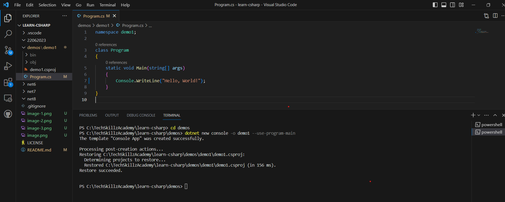
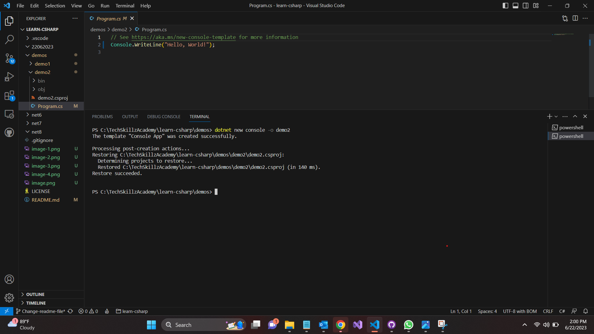
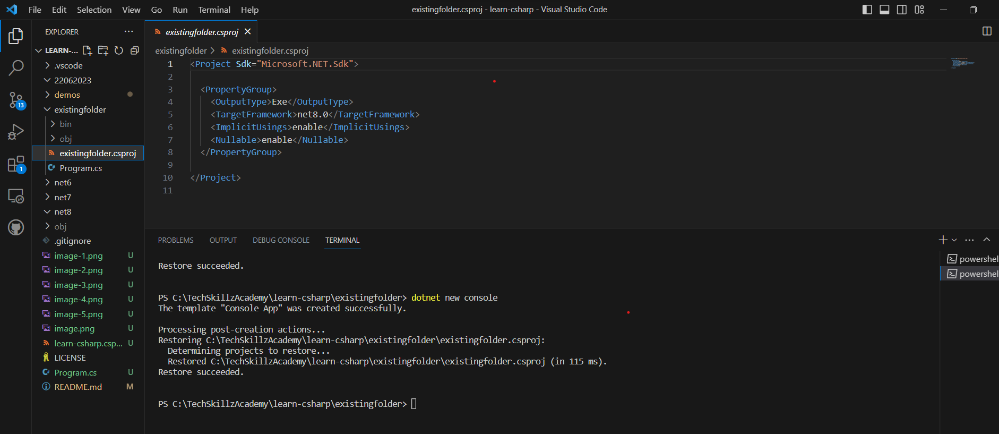
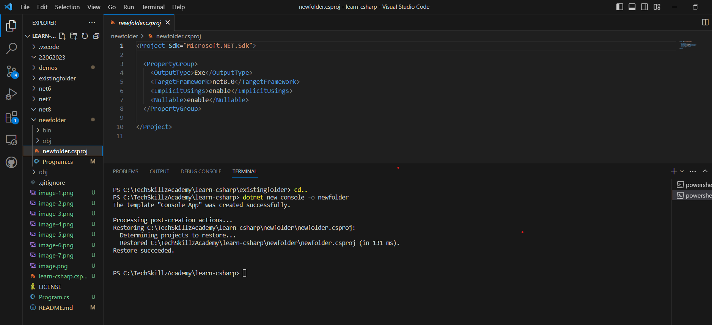
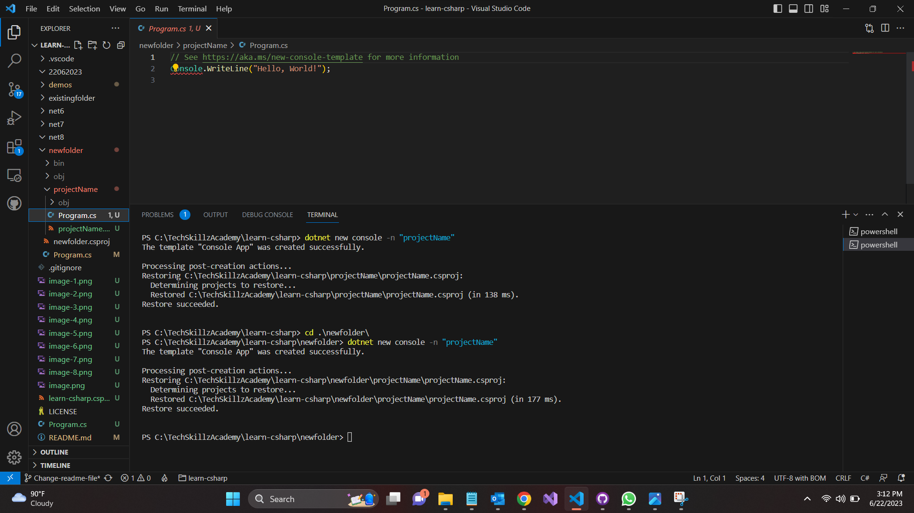
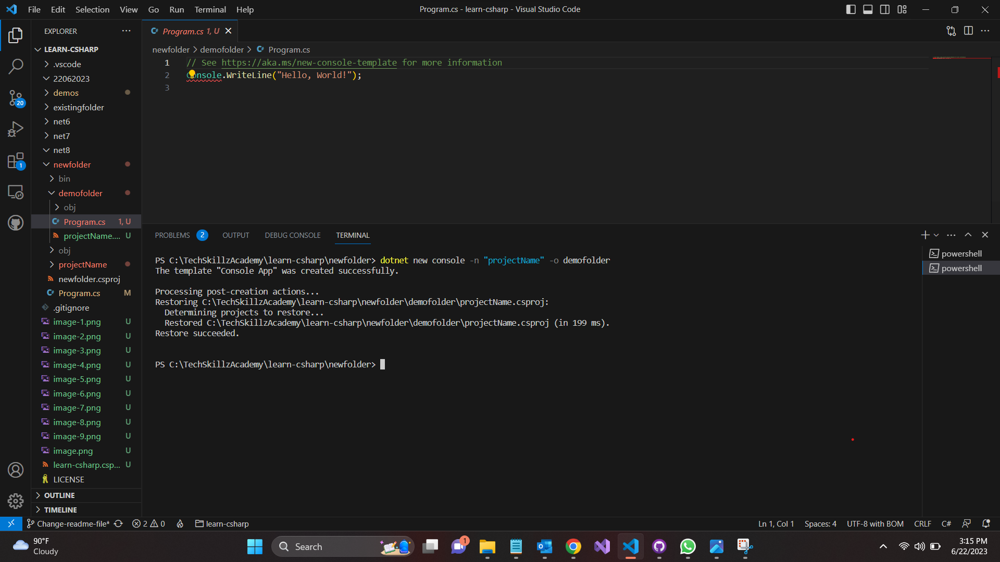

# Introduction to Microservices
## Date Time: 29-July-2023 at 09:00 AM IST
### Event URL:
### Youtube URL:

## Prerequisites:
1. Basic of C sharp Programming language

## Software/Tools
1. Visual studio
2. GitHub Desktop
3. gitbash
4. Windows terminal 


## Languages:
1. C sharp(C#)

## Information

1. Console Application without Top Level Programs
2. Console Application with Top Levelprograms
3. Creating a Cosnole Application within an Existing and New folder
4. Creating a Console Application within a new folder
5. Creating a Console Application with .NET (6/7/8)
6. Creating a Console Application with .NET 6
7. Creating a Console Application with .NET 7
8. Creating a Console Application with .NET 8
9. Creating a Console Application with global.json inside folder
10. Creating a Console Application with .NET 6
11. Creating a Console Application with .NET 7
12. Creating a Console Application with .NET 8
13. Executing the Same Application in .NET 6/7/8
14. Execute Sample C# Code


## Creating Console Application using C#.

## 1. Console Application without Top Level Programs.
```
dotnet new console -o demo1 --use-program-main
```


## 2. Cosnole Application with Top Level Programs.
``` 
dotnet new console -o demo2
```

```using System;
using System.Runtime.CompilerServices;
[CompilerGenerated]
internal class Program
{
    private static void <Main>$(string[] args)
    {
        Console.WriteLine("Hello, World!");
    }
}  
```



## 3. Creating a Cosnole Application within an Existing and New folder.

### 3.1.  Creating a Console Application within an Existing folder.
> 
1. Create a folder existingfolder
2. Open cmd and navigate to existingfolder 
3. Run the below command
4. This will create a console application within the existingfolder
5. It will name the console application as existingfolder

```
dotnet new console
```

## 3.2. Creating a Console Application within a new folder.
>
1. Execute the below command   
2. This will create a console application within the newfolder 
3. It will name the console application as newfolder

```
dotnet new console -o newfolder
dotnet new console -n "projectName"
dotnet new console -n "projectName" -o folderName
```



The Project file name will be same as folder name.



This will create the Porject file with different name.



This will create project inside specified folder.

## 4. Creating a Console Application with .NET (6/7/8).


### 4.1. Creating a Console Application with .NET 6.
```
dotnet new console -o demo3 -f net6.0
```


### 4.2.  a Console Application with .NET 7.
```
dotnet new console -o demo4 -f net7.
```


### 4.3. Creating a Console Application with .NET 8.
```
dotnet new console -o demo5 -f net8.0
```


## 5. Creating a Console Application with global.json inside folder.

> Execute the below command

``` dotnet new list
dotnet new globaljson --help
dotnet --list-sdks

dotnet new globaljson --sdk-version <VersionNumber> --dry-run
dotnet new globaljson --sdk-version <VersionNumber>
```

### 5.1. Creating a Console Application with .NET 6.
```
dotnet --list-sdks
dotnet new globaljson --sdk-version 6.0.408 --dry-run
dotnet new globaljson --sdk-version 6.0.408
dotnet new console -o demo6
```

### 5.2. Creating a Console Application with .NET 7.
```
dotnet --list-sdks
dotnet new globaljson --sdk-version 7.0.105 --dry-run
dotnet new globaljson --sdk-version 7.0.105
dotnet new console -o demo7
```


### 5.3. Creating a Console Application with .NET 8.
```
dotnet --list-sdks
dotnet new globaljson --sdk-version 8.0.100-preview.4.23260.5 --dry-run
dotnet new globaljson --sdk-version 8.0.100-preview.4.23260.5
dotnet new console -o demo8
```

## 6. Executing the Same Application in .NET 6/7/8.
>
1. Execute the project in 6/7/8
2. View the output
### 6.1 . Sample C# Code.

```
// See https:// aka.ms/ new-console-template for more information
Console.WriteLine(Environment.CurrentDirectory);
Console.WriteLine(Environment.OSVersion.VersionString);
Console.WriteLine(Environment.Version);
Console.WriteLine(Environment.UserName);
Console.WriteLine(Environment.MachineName);
Console.WriteLine(Environment.ProcessorCount);
Console.WriteLine(Environment.SystemDirectory);
Console.WriteLine(Environment.UserDomainName);
Console.WriteLine(Environment.UserInteractive);
Console.WriteLine(Environment.WorkingSet);
Console.WriteLine(Environment.Is64BitOperatingSystem);
Console.WriteLine(Environment.Is64BitProcess);
```


Execute the .NET 6 project after writing above code.


Execute the .NET 7 project after writing above code.


Execute the .NET 8 project after writing above code.